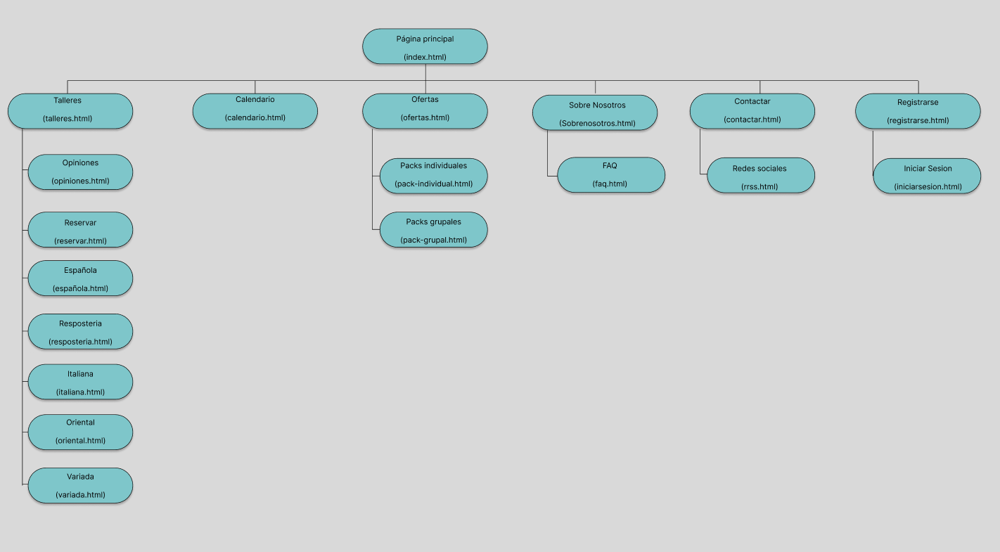
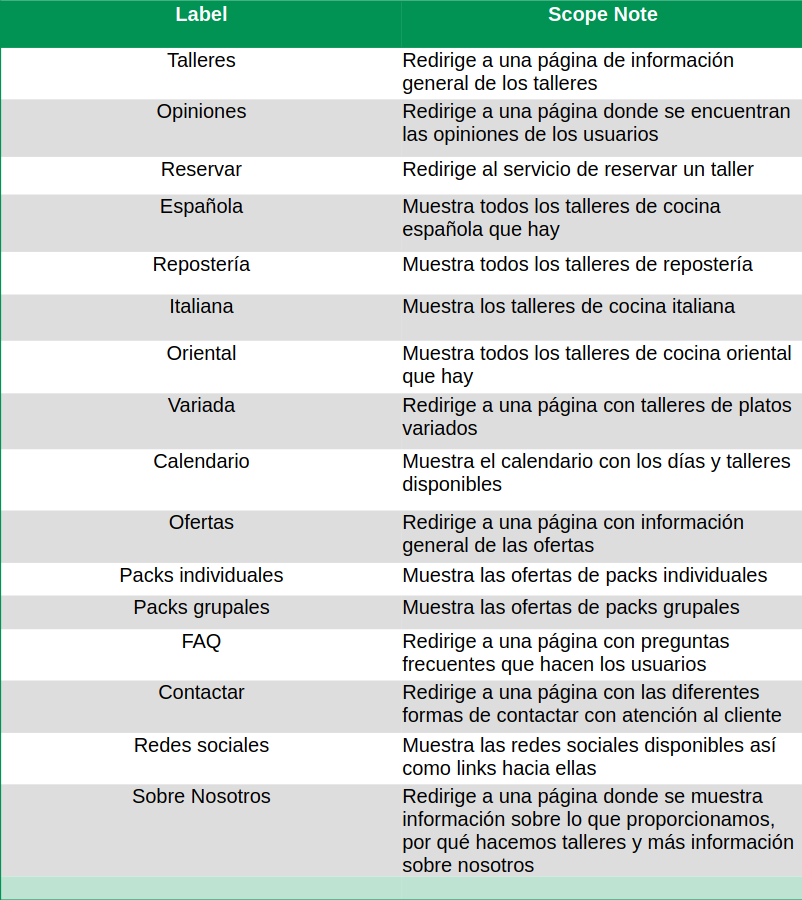
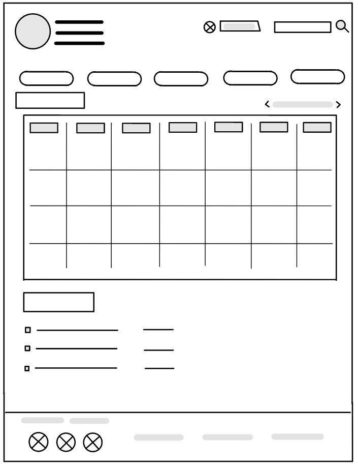
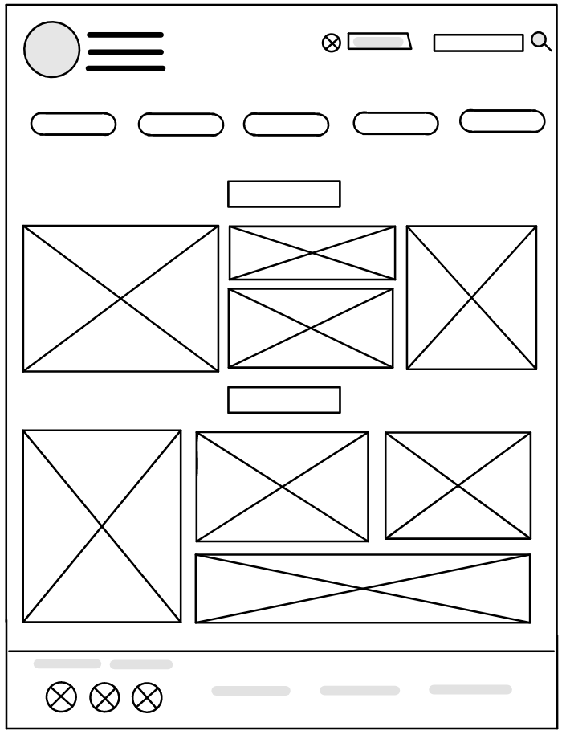
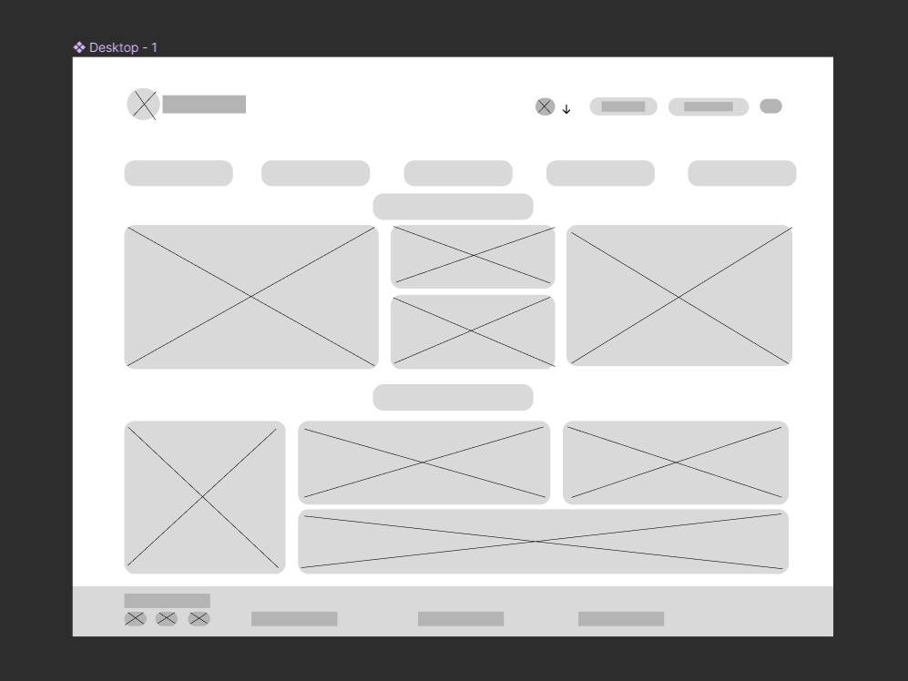

## DIU - Practica2, entregables

### Ideación 

### PROPUESTA DE VALOR

### TASK ANALYSIS

### ARQUITECTURA DE INFORMACIÓN

### Prototipo Lo-FI Wireframe 
 
   .png)
 
   
 
   
 
   

### Conclusiones  
(incluye valoración de esta etapa)
