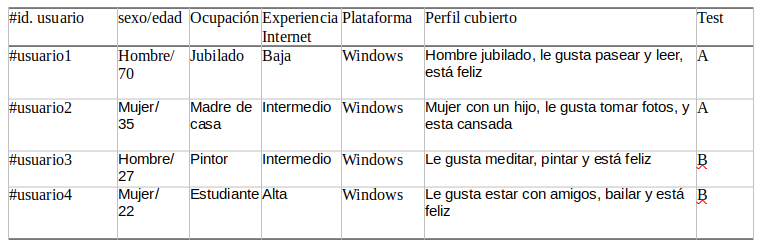
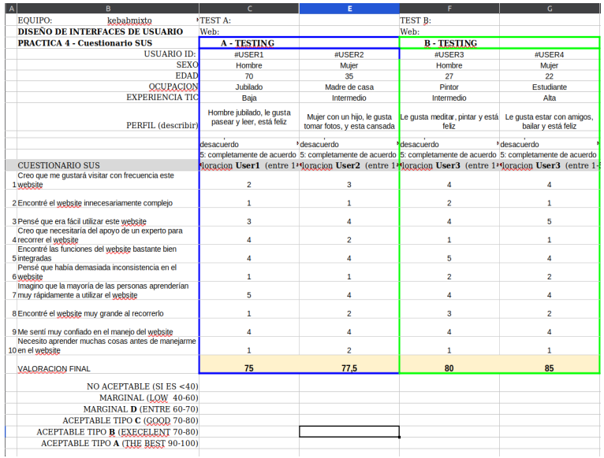

# DIU - Practica 4, entregables

Revisar [Asignacion_ABtesting](https://github.com/mgea/DIU/blob/master/P4/Asignacion_ABtesting.pdf)
Lista de grupos 

* Users
>>> El objetivo es escoger 4 personas de forma aleatoria, utilizando role playing para evaluar el prototipo A y el prototipo B.
>>> Tiramos unos dados con varias necesidades que se podrían presentar, y resumirlos en la siguiente tabla:
  

Elección y características

* A/B Testing. 
>>> Hemos usado 4 personas ficticias usando los usuarios del apartado de roleplay, y haciendo el test de cómo sería con cada rol:
  

* Tareas realizadas 
>>> A la hora de realizar el test de usabilidad, lo primero que hemos hecho es crear nuestros cuatro usuarios ficticios utilizando un dado, una vez creados hemos determinado la interacción de cada uno con la página, teniendo roles muy diversos que abarcan una gran mayoría de las personas.
>>> Para la realización de las tareas nos hemos centrado en las preguntas del test de usabilidad, por ejemplo, ver si es complejo navegar en la página, si necesitaría ayuda, si necesitan saber algo antes, etc.Como resultado del test nos ha dado una valoración de +80 lo cuál está muy bien, como se aprecia en el apartado 4 del documento.
>>> Y también a cada usuario se le ha hecho un test de eye tracking, cuyos resultados se venen el siguiente enlace:
[Eye Tracking](EyeTracking.pdf)

* Usability Report de Caso B
  [Report](P4_UsabReport_DIU2CaOs_doneby_DIU2_kebabmixto.pdf)

* Conclusiones
Como aspecto negativo solo hemos notado una cierta demora en cargar las páginas,  y que no hay un apartado de “Quienes somos”. 
Aún así, a nosotros nos ha gustado bastante la página, ya que nos parece estética, y que se centra en lo importante, haciendo una experiencia más rápida y satisfactoria, por su sencillez y formato, bien diseñada, teniendo todo accesible y cerca, con una paleta de colores y tipografía de letras de son agradables.
