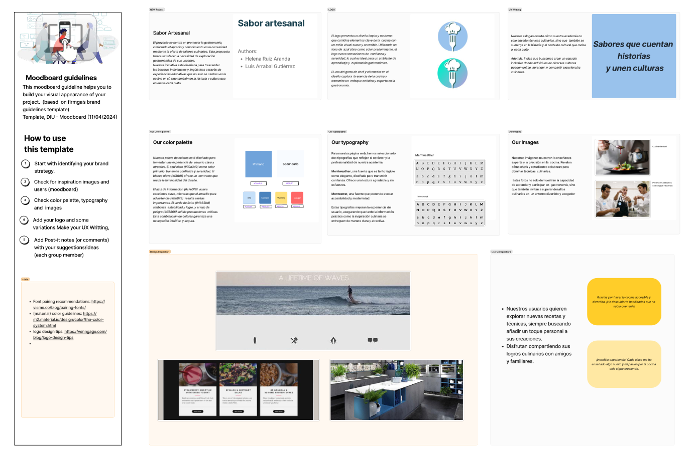

# DIU24
Prácticas Diseño Interfaces de Usuario 2023-24 (Tema: Experiencias gastrónomicas ) 

Grupo: DIU2_kebabmixto.  Curso: 2023/24 
Updated: 31/5/2024

Proyecto: 
### Sabor Artesanal 

Descripción: 

>>> Nuestra página web se centra en ofrecer experiencias gastronómicas a través de una variedad de cursos y talleres de cocina. Nuestro objetivo es proporcionar a los usuarios una experiencia agradable y enriquecedora, facilitando el aprendizaje de habilidades culinarias en un entorno accesible y bien diseñado.

Logotipo: 

Miembros
 * :bust_in_silhouette:  Luis Arrabal Gutiérrez     :octocat:     
 * :bust_in_silhouette:  Helena Ruiz Aranda     :octocat:

----- 

# Proceso de Diseño 

## Paso 1. UX User & Desk Research & Analisis 

 **1.a User Reseach Plan**
-----

>>> El objetivo del User Research es establecer el contexto y objetivos de la
investigación y descubrir lo que es importante para los usuarios y cómo esto
puede impactar en nuestro diseño. Definir unos objetivos claros es importante
para el desarrollo de nuestro producto.
La investigación la hemos realizado mediante nuestras experiencias, además
de algunas encuestas a nuestro entorno.

 1.b Competitive Analysis
-----

>>> GranadaCooking ofrece ventajas para socios y tiene una página bien construida, sin embargo presenta algunos fallos que pueden hacer que la experiencia del usuario sea desagradable, como el calendario para seleccionar talleres que es poco intuitivo e incomódo.

>>> PilsaEduca también ofrece una gran variedad de talleres de cocina y es fácil de usa. Aunque tienen un gran abanico de talleres, la información de la web nos ha parecido escasa lo que puede complicar la elección de una actividad.

 1.c Persona
-----

>>> Hemos seleccionado a estas personas porque nos parecía interesante ponernos en la piel de personas que pueden tener problemas más allá de la tecnología. Helen, una estudiante de nutrición extranjera, enfrenta desafíos adicionales debido al idioma, lo que complica su interacción con la web. Por otro lado, Leonardo, un padre de mediana edad con un horario apretado, necesita aprender a cocinar para cubrir una necesidad urgente, lo que añade presión a su experiencia de usuario.

>>> Esta selección nos permite explorar y abordar una variedad de problemas reales que los usuarios pueden enfrentar, desde barreras lingüísticas hasta restricciones de tiempo, lo que enriquece el desarrollo y diseño de nuestro producto .

 1.d User Journey Map
----

>>> Hemos elegido la experiencia de Leonardo porque es representativa de usuarios con limitaciones de tiempo y responsabilidades familiares, lo cual es una situación habitual para muchos adultos. Esto nos ayuda a identificar y solucionar problemas relacionados con la accesibilidad y eficiencia de la web.
>>> Hemos elegido la experiencia de Helen para representar a los usuarios que enfrentan desafíos adicionales debido al idioma y la falta de familiaridad con la plataforma. Esta situación es común para muchos estudiantes internacionales y usuarios no nativos, lo que nos permite diseñar soluciones más inclusivas y accesibles.

 1.e Usability Review
----

>>> - Enlace al documento:  
>>> - Valoración final (numérica): 71
>>> - Comentario sobre la valoración:  Granada Cooking presenta una usabilidad moderada. Aunque la web tiene una navegación consistente y enlaces claros, su sobrecarga de información y procesos de reserva complicados pueden frustrar a los usuarios. Sin embargo, cuenta con secciones bien organizadas y suficiente contenido visual.

## Paso 2. UX Design  

 2.a Reframing / IDEACION: Feedback Capture Grid / EMpathy map 
----

 2.b ScopeCanvas
----

 2.b User Flow (task) analysis 
-----

 2.c IA: Sitemap + Labelling 
----
 
 
 

 2.d Wireframes
-----
 
   .png)
 
   
 
   
 
   

     

## Paso 3. Mi UX-Case Study (diseño)

 3.a Moodboard
-----

### Descripción del Moodboard

#### Paleta de Colores
- **Azul claro (#70a3d9)**: Confianza y serenidad.
- **Blanco nieve (#f8fbff)**: Luminosidad y contraste.
- **Azul de información (#c7e0f9)**: Claridad en secciones clave.
- **Amarillo de advertencia (#ffe079)**: Alertas importantes.
- **Verde de éxito (#4b83bd)**: Estabilidad y logro.
- **Rojo de peligro (#ff6868)**: Precauciones críticas.

#### Concepto: Sabor Artesanal
Promovemos la gastronomía con talleres culinarios que exploran la historia y cultura de cada plato, creando experiencias educativas inclusivas.

#### Tipografía
- **Merriweather**: Legible y elegante.
- **Montserrat**: Accesibilidad y modernidad.

#### Imágenes
Muestran la colaboración entre chefs y estudiantes, destacando la enseñanza experta y la superación de desafíos culinarios en un entorno acogedor.

#### Logo y Eslogan
- **Logo**: Diseño moderno con gorro de chef y tenedor en azul claro, evocando confianza y serenidad.
- **Eslogan**: "Sabores que cuentan historias y unen culturas."

#### Directrices
Guía visual basada en pautas de marca, enfocada en estrategia, imágenes, colores, tipografía, comentarios y diseño del logo.

En resumen, nuestro moodboard combina colores claros, tipografías legibles, imágenes inspiradoras y un diseño de logo inclusivo para nuestra academia culinaria.

  3.b Landing Page
----

### Descripción de la Landing Page

>>> Nuestra landing page de Sabor Artesanal está diseñada para atraer a entusiastas de la cocina de todos los niveles, ofreciendo talleres culinarios variados. Hemos utilizado los colores y tipografías de nuestra marca para asegurar una experiencia de usuario coherente y atractiva.
>>> Esta landing page combina colores atractivos, tipografías legibles y contenido inspirador para promover nuestra academia culinaria y atraer a nuevos estudiantes.

 3.c Guidelines
----

>>> Estudio de Guidelines y Patrones IU a usar 
>>> Tras documentarse, muestre las deciones tomadas sobre Patrones IU a usar para la fase siguiente de prototipado.

Los patrones que vamos a utililzar para el diseño son los siguientes:
+ Onboarding: Es la secuencia de pantallas iniciales que guían a los nuevos usuarios a través de las principales características de la aplicación.
+ Menu (Navbar adaptada a móvil): Es una barra de navegación superior diseñada para facilitar la navegación del usuario por la aplicación.
+ Hero image y Carrousel: Una imagen grande y llamativa sobre uno de los talleres colocada en la parte superior de la página, acompañada de un carrusel de imágenes de otros talleres que rota.
+ Search: Una barra de búsqueda en la parte superior de la pantalla que permite buscar cursos, recetas, etc.
+ Wizards (explain process): Una serie de pantallas que guían a los usuarios a través del proceso de inscripción en un curso, paso a paso.
+ Article List (5-7 Cards items): Una sección que muestra tarjetas de cursos cada una con una imagen, título y una breve descripción.
+ Item Details + Actions: La página de detalles de un curso que incluye la descripción del curso, la duración, el precio y botones para inscribirse.
+ Reserva: Un formulario de reserva donde los usuarios pueden seleccionar la fecha y hora de una clase de cocina y confirmar su reserva.
+ Form Input: Campos para ingresar el nombre, correo electrónico y otros detalles para contactar con la empresa.
+ Shopping Cart: Un carrito de compras que muestra las ofertas y/o cursos seleccionados, con opciones para ajustar cantidades o eliminar artículos.
+ About: Una sección "Sobre Nosotros" que incluye la historia de la academia de cocina y su misión.
+ Event Calendar (disponibilidad): Un calendario donde los usuarios pueden ver todas las clases de cocina programadas para el mes.
+ Tags/Etiquetas/Categorías: Etiquetas como "Pastelería", "Cocina Italiana", "Principiantes" para filtrar recetas o cursos.

  3.d Mockup
----
[https://www.figma.com/design/f96SAtI0UP8AQqCdTd3lqi/DIU2_kebabmixto?node-id=0%3A1&t=FTKdFDzxgUleTMOC-1]
>>> El mockup nos lleva por varias tareas destacables en nuestra web, como son: iniciar sesión, seleccionar un taller del calendario, contactar con la empresa, ver las reservas del usuario y reservar un taller.

 3.e ¿My UX-Case Study?
-----

>>> Publicar my Case Study en Github..
>>> Documente y resuma el diseño de su producto

## Paso 5. Exportación & evaluación con Eye Tracking 

Exportación a HTML/Flutter
-----

)  5.b Eye Tracking method 

>>> Indica cómo diseñas experimento y reclutas usuarios (uso de gazerecorder.com)  

Diseño del experimento 
----

>> Uso de imágenes (preferentemente) -> hay que esablecer una duración de visualización y  
>> fijar las áreas de interes (AoI) antes del diseño. Planificar qué tarea debe hacer el usuario (buscar, comprar...) 

  
>> cambiar img por tu diseño de experimento  

>> Recordar que gazerecorder es una versión de pruebas: usar sólo con 3 usuarios para generar mapa de calor (recordar que crédito > 0 para que funcione) 

Resultados y valoración 
-----

>> Cambiar por tus resultados
  

## Paso 4. Evaluación 

 4.a Caso asignado
----

>>> Breve descripción del caso asignado con enlace a  su repositorio Github

 4.b User Testing
----

>>> Seleccione 4 personas ficticias. Exprese las ideas de posibles situaciones conflictivas de esa persona en las propuestas evaluadas. Asigne dos a Caso A y 2 al caso B
 

| Usuarios | Sexo/Edad     | Ocupación   |  Exp.TIC    | Personalidad | Plataforma | TestA/B
| ------------- | -------- | ----------- | ----------- | -----------  | ---------- | ----
| User1's name  | H / 18   | Estudiante  | Media       | Introvertido | Web.       | A 
| User2's name  | H / 18   | Estudiante  | Media       | Timido       | Web        | A 
| User3's name  | M / 35   | Abogado     | Baja        | Emocional    | móvil      | B 
| User4's name  | H / 18   | Estudiante  | Media       | Racional     | Web        | B 

 4.c Cuestionario SUS
----

>>> Usaremos el **Cuestionario SUS** para valorar la satisfacción de cada usuario con el diseño (A/B) realizado. Para ello usamos la [hoja de cálculo](https://github.com/mgea/DIU19/blob/master/Cuestionario%20SUS%20DIU.xlsx) para calcular resultados sigiendo las pautas para usar la escala SUS e interpretar los resultados
http://usabilitygeek.com/how-to-use-the-system-usability-scale-sus-to-evaluate-the-usability-of-your-website/)
Para más información, consultar aquí sobre la [metodología SUS](https://cui.unige.ch/isi/icle-wiki/_media/ipm:test-suschapt.pdf)

>>> Adjuntar captura de imagen con los resultados + Valoración personal 

 4.d Usability Report
----

>>  Conclusion de EVALUACION (A/B testing + usability report + eye tracking) 
----

>> recupera el usability report de tu práctica (que es el caso B de los asignados a otros grupos) 
>> con los resultados del A/B testing, de eye tracking y del usability report:
>>  comentad en 2-3 parrafos cual es la conclusion acerca de la realización de la práctica y su evaluación con esas técnicas y que habéis aprendido

## Conclusión final / Valoración de las prácticas

>>> (90-150 palabras) Opinión FINAL del proceso de desarrollo de diseño siguiendo metodología UX y valoración (positiva /negativa) de los resultados obtenidos  

